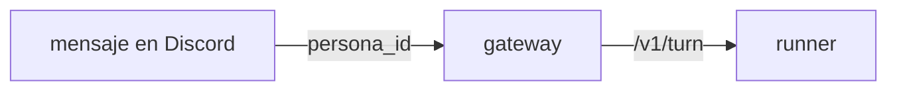

# /diagrama — dibuja lo que la prosa no logró explicar

ARGUMENTS: `$ARGUMENTS` — qué es lo que no se entiende. Si viene vacío, toma **lo
último que explicaste** y que la persona no acabó de entender.

## Para qué existe

Hay cosas de este repo que en prosa son un muro y en dibujo son obvias: por dónde
pasa un turno, quién llama a quién, en qué orden se apilan las capas de un prompt,
qué archivos toca un cambio. **Este comando no explica otra vez con más palabras —
cambia de medio.**

Está pensado especialmente para cuando alguien está aprendiendo el repo y necesita
ver la forma antes que el detalle.

## Procedimiento

1. **Lee el código real antes de dibujar.** Nada de diagramas de memoria ni de lo
   que "suele" hacer un sistema así. Abre los archivos, sigue las llamadas, y
   dibuja lo que de verdad está ahí. Un diagrama bonito y falso es peor que ningún
   diagrama, porque se recuerda.
2. **Escoge la forma según lo que se está preguntando:**
   - *"¿por dónde pasa esto?"* → `flowchart LR` (o `TD` si son muchos pasos)
   - *"¿quién le habla a quién y en qué orden?"* → `sequenceDiagram`
   - *"¿en qué estados puede estar?"* → `stateDiagram-v2`
   - *"¿cómo se relacionan estas piezas?"* → `classDiagram` o `erDiagram`
3. **Un diagrama, no cinco.** Si no cabe en uno, es que hay dos preguntas
   distintas: dibuja la primera y ofrece la segunda.
4. **Máximo ~12 nodos.** Arriba de eso deja de ser un mapa y vuelve a ser un muro.
   Agrupa con `subgraph` en vez de agregar cajas.
5. **Etiqueta las flechas con lo que de verdad viaja** (`persona_id`,
   `behavioral_guidance`, `[REACT:]`), no con verbos vacíos como "envía" o "usa".
6. **Debajo del diagrama, tres o cuatro líneas** que digan qué mirar primero y
   dónde vive cada caja en el repo (`archivo.py:línea`). El diagrama enseña la
   forma; esas líneas la aterrizan en el código.
7. Si algo no lo pudiste verificar en el código, **dilo en una línea** en vez de
   dibujarlo con confianza.

## Formato de salida

Un bloque de código con lenguaje `mermaid`. Discord y GitHub lo renderizan solos;
en la terminal se lee bien de todos modos porque es texto.

````

````

## Reglas

- **NUNCA inventes una caja para que el dibujo quede simétrico.** Si una pieza no
  existe, no se dibuja.
- **NUNCA dibujes lo que el README dice si el código dice otra cosa** — gana el
  código, y lo mencionas.
- Nombres de cajas en el idioma de la persona; nombres de archivos y símbolos tal
  como están en el repo.
- Si lo que confunde resultó ser una sola línea de código, **dilo y no dibujes**:
  a veces la respuesta honesta es "no necesitas un diagrama, necesitas ver esta
  línea".
