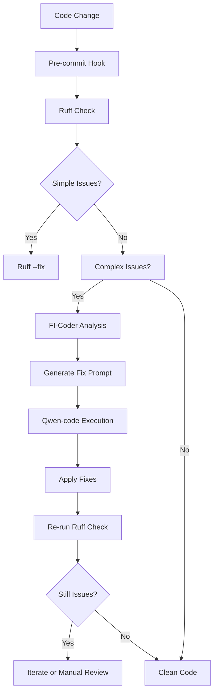

# Code Quality Strategy: Ruff + FI-Coder Hybrid System

## Overview

Free Intelligence implements a layered code quality system that combines the speed of Ruff for fast validations with the intelligence of FI-Coder for complex fixes. This hybrid approach ensures both performance and code quality.

## Architecture

### Layer 1: Fast Validation (Ruff - Pre-commit)
- **Purpose**: Rapid style and common error detection
- **Trigger**: Pre-commit hooks and CI/CD pipelines
- **Scope**: All Python files in `backend/` and `tests/`
- **Performance**: < 2 seconds for typical codebase
- **Rules**: Configured in `pyproject.toml` and `.pre-commit-config.yaml`

### Layer 2: Intelligent Fixes (FI-Coder)
- **Purpose**: AI-powered solutions for complex linting issues
- **Trigger**: Manual execution or CI/CD on demand
- **Scope**: Issues that require code understanding and refactoring
- **Performance**: Variable (30-600 seconds depending on complexity)
- **Engine**: Qwen-code CLI wrapper with healthcare-grade safety constraints

## Commands

### Fast Validation
```bash
# Quick lint check (pre-commit standard)
PYTHONPATH=backend/src python -m fi_cli coder lint-fix

# Auto-fix simple issues (Ruff --fix is handled automatically)
PYTHONPATH=backend/src python -m fi_cli coder lint-fix
```

### Intelligent Fixes
```bash
# Apply AI-powered fixes for complex issues (recommended)
PYTHONPATH=backend/src python -m fi_cli coder lint-fix

# Preview fixes without applying them
PYTHONPATH=backend/src python -m fi_cli coder lint-fix --dry-run
```

### Direct CLI Usage
```bash
# Fix specific file
PYTHONPATH=backend/src python -m fi_cli coder lint-fix --file=backend/src/example.py

# Process Ruff output directly
ruff check backend/ | PYTHONPATH=backend/src python -m fi_cli coder lint-fix --ruff-output=-
```

## Issue Classification

### Simple Fixes (Ruff --fix)
- Line length violations (E501)
- Import sorting (I001)
- Whitespace issues (W291-W293)
- Blank line spacing (E302-E306)

### Complex Fixes (FI-Coder)
- Unused imports with context analysis (F401)
- Variable usage analysis (F841)
- Function call in defaults (B008)
- Code simplification opportunities (SIM*)
- Syntax modernization (UP*)
- Naming convention improvements (N*)
- Built-in shadowing detection (A*)
- Complex bug patterns (B*)

## Integration Flow



## Safety & Security

### PHI/PII Protection
- No patient data exposure in logs
- Correlation IDs only for tracking
- Structured logging without sensitive content

### Code Quality Gates
- Ruff runs first (fast feedback)
- FI-Coder only for complex issues
- Manual review required for critical changes
- Pre-commit hooks prevent accidental commits

## Performance Optimization

### Pre-commit Performance
- Ruff configured with `--exit-zero` to avoid blocking commits
- Fast execution (< 2 seconds)
- Minimal false positives
- Configurable exclusions for legacy code

### Intelligent Fix Performance
- Timeout protection (default 600 seconds)
- Issue batching (max 10 issues per file)
- Dry-run mode for preview
- Incremental application

## Configuration

### Ruff Configuration (`pyproject.toml`)
```toml
[tool.ruff]
line-length = 100
target-version = "py314"
select = ["E", "F", "W", "I", "N", "UP", "B", "A", "C4", "SIM"]
ignore = ["E501"]
```

### Pre-commit Configuration (`.pre-commit-config.yaml`)
```yaml
- repo: https://github.com/astral-sh/ruff-pre-commit
  rev: v0.14.5
  hooks:
    - id: ruff
      args: [--fix, --exit-zero]
      stages: [pre-commit]
```

## Usage Examples

### Development Workflow
```bash
# 1. Make changes
vim backend/src/my_module.py

# 2. Fast validation (automatic via pre-commit)
git commit -m "feat: add new functionality"

# 3. If complex issues remain, apply intelligent fixes
PYTHONPATH=backend/src python -m fi_cli coder lint-fix

# 4. Verify fixes
PYTHONPATH=backend/src python -m fi_cli coder lint-fix
```

### CI/CD Integration
```yaml
- name: Code Quality Check
  run: PYTHONPATH=backend/src python -m fi_cli coder lint-fix

- name: Intelligent Fixes (on failure)
  run: PYTHONPATH=backend/src python -m fi_cli coder lint-fix
  if: failure()
```

## Troubleshooting

### Common Issues

**FI-Coder timeout**
- Reduce scope: `PYTHONPATH=backend/src python -m fi_cli coder lint-fix --file=specific_file.py`
- Increase timeout: `PYTHONPATH=backend/src python -m fi_cli coder lint-fix --timeout=1200`

**False positives in complex analysis**
- Use dry-run: `PYTHONPATH=backend/src python -m fi_cli coder lint-fix --dry-run`
- Manual review before applying

**Pre-commit slowdown**
- Review `.pre-commit-config.yaml` exclusions
- Consider `pre-commit run --all-files` for full scans

### Monitoring

- Pre-commit execution time tracked via observability
- FI-Coder success rates logged
- Issue classification metrics collected

## Future Enhancements

- Machine learning-based issue prioritization
- Custom rule integration with FI-Coder
- Automated PR generation for fixes
- Integration with code review tools</content>
<parameter name="filePath">/Users/bernardurizaorozco/Documents/free-intelligence/docs/CODE_QUALITY_STRATEGY.md