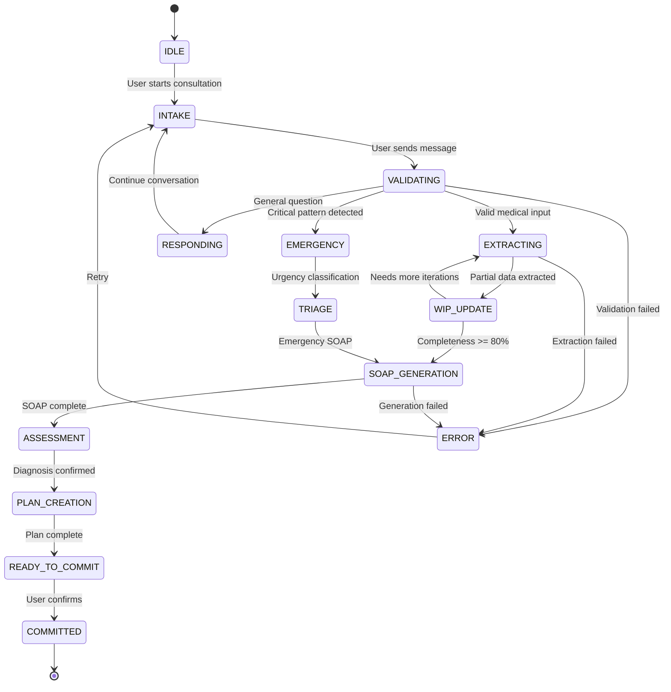
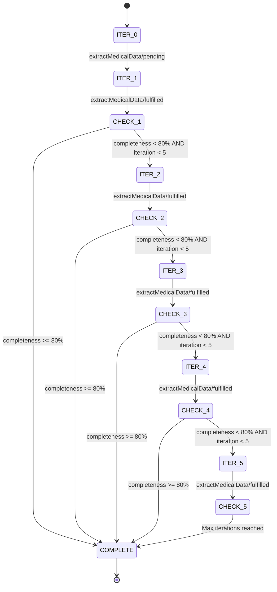
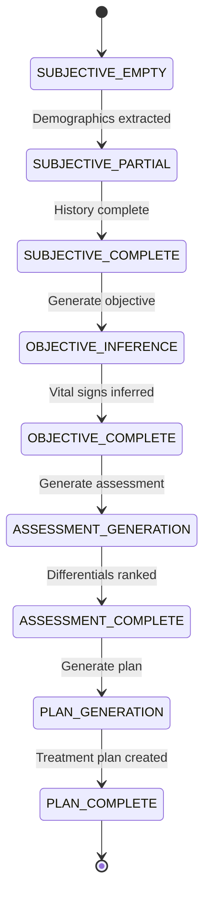
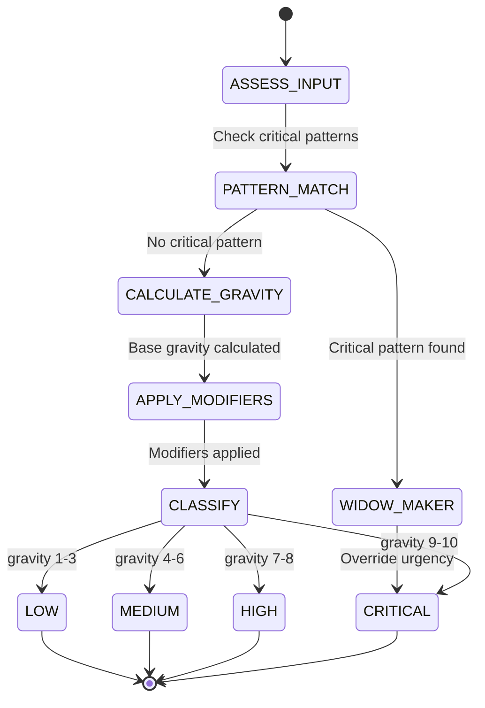
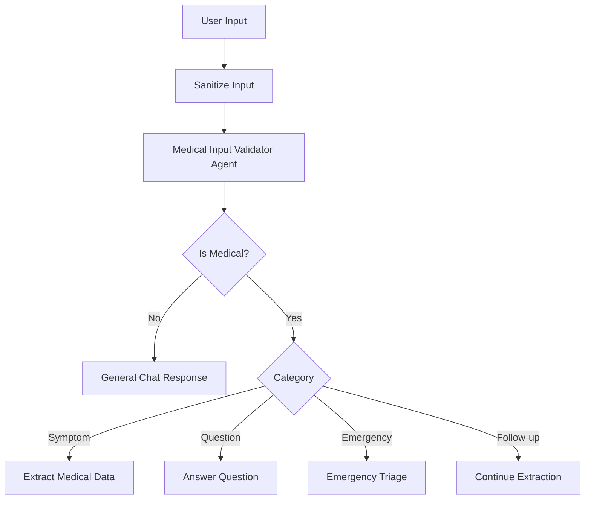
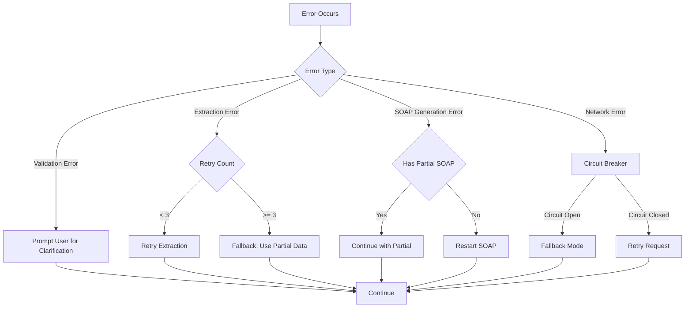

# CONSULTATION FLOW: State Machine & Clinical Workflow

**Source**: Redux-Claude Medical AI System
**Analysis Date**: 2025-10-28
**Purpose**: State machine specification for FI consultation module

---

## 1. CONSULTATION STATE MACHINE

### Primary States



### State Definitions

#### IDLE
- **Description**: No active consultation
- **Redux State**: `isExtracting: false, messages: []`
- **Entry Actions**: None
- **Exit Actions**: Initialize session, create sessionId
- **Transitions**:
  - `User starts consultation` → INTAKE

#### INTAKE
- **Description**: Gathering initial patient information
- **Redux State**: `isExtracting: false, currentIteration: 0`
- **Entry Actions**: Display welcome prompt, reset WIP data
- **Exit Actions**: None
- **Transitions**:
  - `User sends message` → VALIDATING

#### VALIDATING
- **Description**: Validating user input for medical relevance
- **Redux State**: `isLoading: true`
- **Entry Actions**:
  - Dispatch `addMessage` (user message)
  - Call `medicalInputValidatorAgent`
- **Exit Actions**: Store validation result
- **Transitions**:
  - `Valid medical input` → EXTRACTING
  - `General question` → RESPONDING
  - `Critical pattern detected` → EMERGENCY
  - `Validation failed` → ERROR

#### EXTRACTING
- **Description**: Extracting structured medical data from conversation
- **Redux State**:
  ```typescript
  {
    isExtracting: true,
    currentIteration: 1-5,
    extractionProcess.isExtracting: true
  }
  ```
- **Entry Actions**:
  - Dispatch `extractMedicalData/pending`
  - Call `medicalDataExtractorAgent`
- **Exit Actions**: Store extraction result
- **Transitions**:
  - `Partial data extracted` → WIP_UPDATE
  - `Extraction failed` → ERROR

#### WIP_UPDATE
- **Description**: Updating work-in-progress data with extracted information
- **Redux State**:
  ```typescript
  {
    wipData: { demographics, symptoms, context },
    extractionProcess.currentIteration: n
  }
  ```
- **Entry Actions**:
  - Dispatch `updateDemographics`
  - Dispatch `updateSymptoms`
  - Dispatch `updateContext`
  - Dispatch `updateCompleteness`
  - Calculate completeness percentage
- **Exit Actions**: Check completeness threshold
- **Transitions**:
  - `Needs more iterations AND currentIteration < 5` → EXTRACTING
  - `Completeness >= 80% OR currentIteration >= 5` → SOAP_GENERATION
  - `Update failed` → ERROR

#### SOAP_GENERATION
- **Description**: Generating SOAP note from extracted data
- **Redux State**:
  ```typescript
  {
    soapAnalysis.isExtracting: true,
    medicalExtraction.currentExtraction: MedicalExtractionOutput
  }
  ```
- **Entry Actions**:
  - Dispatch `startSOAPExtraction`
  - Call `SOAPProcessor.processCase()`
  - Generate subjective section
  - Infer objective section
- **Exit Actions**: Store SOAP analysis
- **Transitions**:
  - `SOAP complete` → ASSESSMENT
  - `Generation failed` → ERROR

#### ASSESSMENT
- **Description**: Generating differential diagnoses and assessment
- **Redux State**:
  ```typescript
  {
    soapAnalysis.currentAnalysis.analisis: {
      diagnosticoPrincipal,
      diagnosticosDiferenciales
    }
  }
  ```
- **Entry Actions**:
  - Apply `DefensiveMedicineValidator`
  - Calculate defensive scores (gravity * 0.7 + probability * 0.3)
  - Sort differentials by defensive score
  - Identify red flags
- **Exit Actions**: Store assessment
- **Transitions**:
  - `Diagnosis confirmed` → PLAN_CREATION

#### PLAN_CREATION
- **Description**: Creating treatment and follow-up plan
- **Redux State**:
  ```typescript
  {
    soapAnalysis.currentAnalysis.plan: {
      tratamientoFarmacologico,
      estudiosAdicionales,
      seguimiento
    }
  }
  ```
- **Entry Actions**:
  - Call `clinical_pharmacology` agent
  - Call `specialty_detection` agent
  - Generate medication plan
  - Generate study orders
  - Generate follow-up criteria
- **Exit Actions**: Store plan
- **Transitions**:
  - `Plan complete` → READY_TO_COMMIT

#### READY_TO_COMMIT
- **Description**: SOAP note ready for physician review and commit
- **Redux State**:
  ```typescript
  {
    soapAnalysis.currentAnalysis: SOAPAnalysis (complete),
    soapAnalysis.quality: number (0-1)
  }
  ```
- **Entry Actions**:
  - Display SOAP summary
  - Calculate quality score
  - Show commit prompt
- **Exit Actions**: None
- **Transitions**:
  - `User confirms` → COMMITTED
  - `User requests changes` → INTAKE (edit mode)

#### COMMITTED
- **Description**: SOAP note committed to event store
- **Redux State**:
  ```typescript
  {
    soapAnalysis.analysisHistory: [..., currentAnalysis]
  }
  ```
- **Entry Actions**:
  - Dispatch `completeAnalysis`
  - Create `CONSULTATION_COMMITTED` event
  - Generate SHA256 hash
  - Append to event store (FI: HDF5)
- **Exit Actions**: Reset session
- **Transitions**:
  - `Commit complete` → [*] (END)

#### EMERGENCY
- **Description**: Critical pattern detected, urgent triage required
- **Redux State**:
  ```typescript
  {
    urgencyAssessment: {
      overallLevel: 'critical',
      identifiedPatterns: UrgentPattern[]
    }
  }
  ```
- **Entry Actions**:
  - Trigger `CriticalPatternMiddleware`
  - Dispatch `addCognitiveEvent` (critical)
  - Override urgency to CRITICAL
- **Exit Actions**: Log critical audit entry
- **Transitions**:
  - `Urgency classification` → TRIAGE

#### TRIAGE
- **Description**: Performing medical triage and urgency classification
- **Redux State**:
  ```typescript
  {
    urgencyAssessment: {
      overallLevel: 'critical' | 'high' | 'medium' | 'low',
      timeToAction: string,
      immediateActions: string[]
    }
  }
  ```
- **Entry Actions**:
  - Call `UrgencyClassifier.performTriage()`
  - Calculate gravity score
  - Determine time to action
  - Identify immediate interventions
- **Exit Actions**: Store triage result
- **Transitions**:
  - `Emergency SOAP` → SOAP_GENERATION (expedited)

#### RESPONDING
- **Description**: Responding to general medical question (non-clinical)
- **Redux State**: `isLoading: true`
- **Entry Actions**:
  - Call `intelligent_medical_chat` agent
  - Generate response
- **Exit Actions**:
  - Dispatch `addMessage` (assistant)
- **Transitions**:
  - `Continue conversation` → INTAKE

#### ERROR
- **Description**: Error occurred during processing
- **Redux State**:
  ```typescript
  {
    extractionProcess.error: string,
    cores[coreId].error: string
  }
  ```
- **Entry Actions**:
  - Dispatch `extractMedicalData/rejected` or `setCoreError`
  - Log error to audit
  - Display user-friendly error message
- **Exit Actions**: Clear error on retry
- **Transitions**:
  - `Retry` → INTAKE

---

## 2. EXTRACTION ITERATION WORKFLOW

### Iteration State Machine



### Iteration Logic

```typescript
interface IterationDecision {
  shouldContinue: boolean
  reason: string
  focusAreas: string[]  // What to extract next
}

function decideNextIteration(
  currentExtraction: MedicalExtractionOutput,
  iteration: number
): IterationDecision {
  const completeness = currentExtraction.completeness.percentage

  // Stop if complete
  if (completeness >= 80) {
    return {
      shouldContinue: false,
      reason: 'Sufficient completeness achieved',
      focusAreas: []
    }
  }

  // Stop if max iterations
  if (iteration >= 5) {
    return {
      shouldContinue: false,
      reason: 'Max iterations reached',
      focusAreas: []
    }
  }

  // Continue with focus areas
  const missing = currentExtraction.completeness.missingCriticalFields

  return {
    shouldContinue: true,
    reason: `Completeness ${completeness}%, missing critical fields`,
    focusAreas: missing
  }
}
```

### Iteration Focus Strategy

| Iteration | Focus Area | Extraction Goal |
|-----------|-----------|-----------------|
| 1 | Demographics | Age, gender, weight, height |
| 2 | Chief Complaint | Primary symptoms, duration, severity |
| 3 | Medical History | Past medical history, medications, allergies |
| 4 | Systems Review | Associated symptoms, red flags |
| 5 | Contextual Data | Occupation, lifestyle, psychosocial factors |

---

## 3. SOAP PROGRESSION WORKFLOW

### SOAP Section State Machine



### SOAP Completeness Calculation

```python
def calculate_soap_completeness(soap: SOAPData) -> CompletenessMetrics:
    """Calculate SOAP note completeness and NOM-004 compliance."""

    # Section weights
    WEIGHTS = {
        'subjective': 0.30,
        'objective': 0.25,
        'assessment': 0.25,
        'plan': 0.20
    }

    # Subjective completeness
    subjective_score = 0.0
    if soap.subjetivo.motivoConsulta:
        subjective_score += 0.30
    if soap.subjetivo.historiaActual:
        subjective_score += 0.30
    if soap.subjetivo.antecedentes.medicamentos:
        subjective_score += 0.20
    if soap.subjetivo.antecedentes.alergias:
        subjective_score += 0.20

    # Objective completeness
    objective_score = 0.0
    vital_signs = soap.objetivo.signosVitales
    if vital_signs.presionArterial:
        objective_score += 0.25
    if vital_signs.frecuenciaCardiaca:
        objective_score += 0.25
    if vital_signs.temperatura:
        objective_score += 0.25
    if vital_signs.saturacionOxigeno:
        objective_score += 0.25

    # Assessment completeness
    assessment_score = 0.0
    if soap.analisis.diagnosticoPrincipal:
        assessment_score += 0.50
    if len(soap.analisis.diagnosticosDiferenciales) >= 2:
        assessment_score += 0.30
    if soap.analisis.factoresRiesgo:
        assessment_score += 0.20

    # Plan completeness
    plan_score = 0.0
    if soap.plan.tratamientoFarmacologico:
        plan_score += 0.40
    if soap.plan.seguimiento:
        plan_score += 0.30
    if soap.plan.estudiosAdicionales:
        plan_score += 0.30

    # Overall percentage
    overall = (
        subjective_score * WEIGHTS['subjective'] +
        objective_score * WEIGHTS['objective'] +
        assessment_score * WEIGHTS['assessment'] +
        plan_score * WEIGHTS['plan']
    ) * 100

    # NOM-004 compliance
    nom_violations = check_nom_compliance(soap)
    nom_score = max(0, 100 - len(nom_violations) * 10)

    return CompletenessMetrics(
        percentage=overall,
        sections={
            'subjective': subjective_score * 100,
            'objective': objective_score * 100,
            'assessment': assessment_score * 100,
            'plan': plan_score * 100
        },
        nomCompliance=nom_score,
        nomViolations=nom_violations,
        readyForCommit=(overall >= 80 and nom_score >= 90)
    )
```

---

## 4. URGENCY CLASSIFICATION WORKFLOW

### Urgency State Machine



### Gravity Score Calculation

```python
def calculate_gravity_score(
    symptoms: List[str],
    patient: PatientData,
    medical_history: List[str]
) -> GravityScore:
    """Calculate gravity score (1-10) for urgency classification."""

    base_gravity = 0

    # Base gravity from symptoms
    for symptom in symptoms:
        if symptom in CRITICAL_SYMPTOMS:
            base_gravity = max(base_gravity, 9)
        elif symptom in HIGH_SYMPTOMS:
            base_gravity = max(base_gravity, 7)
        elif symptom in MEDIUM_SYMPTOMS:
            base_gravity = max(base_gravity, 5)
        else:
            base_gravity = max(base_gravity, 3)

    # Risk modifiers
    modifiers = 0.0

    # Age modifiers
    if patient.age and patient.age > 65:
        modifiers += 1.0
    if patient.age and patient.age < 1:
        modifiers += 1.5

    # Comorbidity modifiers
    high_risk_conditions = [
        'diabetes', 'hypertension', 'copd',
        'heart disease', 'immunosuppression'
    ]
    for condition in high_risk_conditions:
        if any(condition in h.lower() for h in medical_history):
            modifiers += 0.5

    # Pregnancy modifier
    if patient.gender == 'female' and any('pregnant' in s.lower() for s in symptoms):
        modifiers += 1.0

    # Final gravity score (capped at 10)
    final_gravity = min(10, base_gravity + modifiers)

    return GravityScore(
        baseGravity=base_gravity,
        modifiers=modifiers,
        finalGravity=final_gravity
    )
```

### Urgency Levels

| Level | Gravity | Time to Action | Examples |
|-------|---------|----------------|----------|
| **CRITICAL** | 9-10 | Immediate (< 5 min) | Cardiac arrest, severe bleeding, respiratory failure |
| **HIGH** | 7-8 | Urgent (< 30 min) | Chest pain, severe headache, altered mental status |
| **MEDIUM** | 4-6 | Priority (< 2 hours) | Moderate pain, fever with comorbidities, persistent vomiting |
| **LOW** | 1-3 | Routine (< 24 hours) | Minor injury, cold symptoms, routine follow-up |

---

## 5. VALIDATION WORKFLOWS

### Input Validation Flow



### Validation Rules

```typescript
interface ValidationRules {
  // Input sanitization
  maxLength: 10000  // characters
  allowedChars: /^[\p{L}\p{N}\p{P}\p{Z}\n]+$/u  // Unicode safe
  stripHTML: true

  // Medical relevance
  minConfidence: 0.7  // 0-1
  requiredCategory: ['symptom', 'question', 'followup', 'emergency']

  // Content filters
  blacklist: ['inappropriate', 'offensive']  // Reject non-medical
}

function validateInput(input: string): ValidationResult {
  // Sanitize
  const sanitized = sanitizeInput(input, ValidationRules)

  // Check medical relevance
  const result = await callClaudeForDecision(
    'medical_input_validator',
    sanitized
  )

  // Validate confidence
  if (result.confidence < ValidationRules.minConfidence) {
    return {
      isValid: false,
      isMedical: false,
      reason: 'Low confidence in medical relevance'
    }
  }

  // Validate category
  if (!ValidationRules.requiredCategory.includes(result.category)) {
    return {
      isValid: false,
      isMedical: false,
      reason: 'Invalid category'
    }
  }

  return {
    isValid: true,
    isMedical: true,
    category: result.category,
    confidence: result.confidence,
    extractedInfo: result.extractedInfo
  }
}
```

---

## 6. ERROR HANDLING WORKFLOWS

### Error Recovery Flow



### Error Types and Recovery

| Error Type | Recovery Strategy | Fallback |
|-----------|------------------|----------|
| **Validation Failed** | Prompt user for clarification | Continue conversation |
| **Extraction Timeout** | Retry with shorter context | Use partial extraction |
| **Max Iterations** | Force complete with partial data | Generate SOAP with warnings |
| **SOAP Generation Failed** | Retry with simpler prompt | Return raw extraction data |
| **Network Error** | Exponential backoff retry | Offline mode (cache) |
| **LLM API Error** | Circuit breaker → Fallback model | Return error to user |

---

## 7. EVENT TIMELINE

### Typical Consultation Event Sequence

```
T=0s     CONSULTATION_STARTED
           └─> consultation_id, session_id, timestamp

T=5s     MESSAGE_RECEIVED (user)
           └─> content, role='user'

T=6s     VALIDATION_COMPLETED
           └─> isValid=true, category='symptom', confidence=0.92

T=7s     EXTRACTION_STARTED
           └─> iteration=1

T=12s    DEMOGRAPHICS_UPDATED
           └─> age=45, gender='male', weight=80

T=13s    SYMPTOMS_UPDATED
           └─> primarySymptoms=['chest pain', 'dyspnea']

T=14s    EXTRACTION_ITERATION_COMPLETED
           └─> iteration=1, completeness=35%

T=15s    EXTRACTION_STARTED
           └─> iteration=2

T=20s    CONTEXT_UPDATED
           └─> medicalHistory=['hypertension', 'diabetes']

T=21s    EXTRACTION_ITERATION_COMPLETED
           └─> iteration=2, completeness=65%

T=22s    EXTRACTION_STARTED
           └─> iteration=3

T=28s    EXTRACTION_COMPLETED
           └─> completeness=85%, nomCompliance=95%

T=30s    CRITICAL_PATTERN_DETECTED
           └─> pattern='Acute MI', gravity=10, widowMakerAlert=true

T=31s    URGENCY_CLASSIFIED
           └─> level='CRITICAL', timeToAction='immediate'

T=32s    SOAP_GENERATION_STARTED

T=40s    SOAP_SECTION_COMPLETED (subjective)
           └─> section='subjective', confidence=0.89

T=45s    SOAP_SECTION_COMPLETED (objective)
           └─> section='objective', confidence=0.76 (inferred)

T=50s    SOAP_SECTION_COMPLETED (assessment)
           └─> section='assessment', diagnostics=5, defensiveScore=8.9

T=55s    SOAP_SECTION_COMPLETED (plan)
           └─> section='plan', medications=2, studies=3

T=56s    SOAP_GENERATION_COMPLETED
           └─> quality=0.87, readyForCommit=true

T=120s   CONSULTATION_REVIEWED
           └─> reviewer='physician', changes=0

T=125s   CONSULTATION_COMMITTED
           └─> event_hash='sha256:abc123...', committed_by='user_id'

T=126s   AUDIT_LOG_CREATED
           └─> operation='commit_consultation', status='success'

T=127s   CONSULTATION_COMPLETED
```

---

## 8. DECISION POINTS

### Key Decision Points in Flow

#### 1. Continue Extraction?
**Location**: After each extraction iteration
**Condition**:
```python
should_continue = (
    completeness < 80 and
    iteration < 5 and
    len(missing_critical_fields) > 0
)
```
**Actions**:
- Yes → `incrementIteration()`, `extractMedicalData()` again
- No → `completeExtraction()`, proceed to SOAP

#### 2. Generate SOAP Now?
**Location**: After extraction complete or max iterations
**Condition**:
```python
should_generate_soap = (
    completeness >= 80 or
    iteration >= 5 or
    urgency_level == 'CRITICAL'
)
```
**Actions**:
- Yes → `startSOAPExtraction()`
- No → Continue conversation, gather more info

#### 3. Apply Defensive Medicine?
**Location**: During assessment generation
**Condition**:
```python
should_apply_defensive = (
    has_red_flags or
    widow_maker_pattern_detected or
    high_risk_patient
)
```
**Actions**:
- Yes → Use defensive formula (gravity * 0.7 + probability * 0.3)
- No → Use standard formula (gravity * 0.3 + probability * 0.7)

#### 4. Escalate Urgency?
**Location**: During urgency classification
**Condition**:
```python
should_escalate = (
    critical_pattern_detected or
    gravity_score >= 9 or
    multiple_red_flags
)
```
**Actions**:
- Yes → Override to CRITICAL, trigger emergency protocol
- No → Use calculated urgency level

#### 5. Commit SOAP?
**Location**: Ready to commit state
**Condition**:
```python
can_commit = (
    completeness >= 80 and
    nom_compliance >= 90 and
    user_confirmed and
    no_blocking_errors
)
```
**Actions**:
- Yes → Create commit event, generate SHA256, append to store
- No → Show blocking issues, return to edit

---

## 9. CONCURRENCY CONSIDERATIONS

### Dual-Core Concurrency

**Dashboard Core** and **Assistant Core** can run concurrently:

```typescript
// Concurrent state updates
dispatch(addMessage({ coreId: 'dashboard', ... }))  // Main chat
dispatch(addMessage({ coreId: 'assistant', ... }))  // Autocomplete

// Shared state protection
const sharedState = {
  currentSession,   // Read-only for both cores
  patientData,      // Write-locked per transaction
  systemHealth      // Updated by system only
}
```

### Race Condition Prevention

```typescript
// Use Redux Toolkit's built-in serialization
// Only one action processed at a time

// For async operations, use abort controllers
const abortController = new AbortController()

dispatch(extractMedicalData({ signal: abortController.signal }))

// If user interrupts:
abortController.abort()
```

---

## 10. VALIDATION CHECKPOINTS

### Critical Validation Points

| Checkpoint | Validation | Blocking? |
|-----------|-----------|-----------|
| **Input Received** | Sanitize, check medical relevance | Yes |
| **Before Extraction** | Message count >= 1, valid session | Yes |
| **After Extraction** | Completeness >= 0%, no null errors | No |
| **Before SOAP** | Completeness >= 80% OR iteration >= 5 | No |
| **After SOAP** | All sections present, NOM compliance | Yes |
| **Before Commit** | Quality >= 0.7, user confirmed | Yes |
| **After Commit** | SHA256 hash generated, audit logged | Yes |

---

## SUMMARY

This flow specification defines:
- ✅ 13 primary states with clear transitions
- ✅ Extraction iteration workflow (max 5 iterations)
- ✅ SOAP progression (0% → 25% → 50% → 75% → 100%)
- ✅ Urgency classification (LOW → MEDIUM → HIGH → CRITICAL)
- ✅ Validation checkpoints at each stage
- ✅ Error recovery strategies
- ✅ Typical event timeline (0s → 127s)
- ✅ 5 critical decision points
- ✅ Concurrency handling for dual-core
- ✅ Comprehensive validation rules

**Ready for implementation in FI event-sourcing architecture.**
